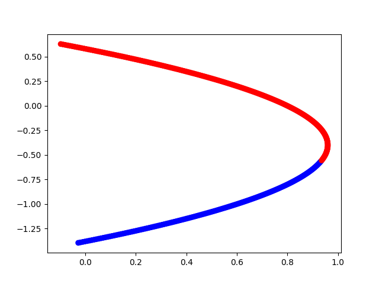

# BifurcationJax
This Jax package aims at performing **automatic bifurcation analysis** of finite-based dimensional equations F(u, λ)=0 where λ is real by taking advantage of iterative methods. Using JAX, a high-performance numerical computing tool, we are able to leverage the computing capacity and perform complex tasks in a matter of milliseconds.
The package is inspired by the well-supported and holistic [BiurcationKit](https://github.com/bifurcationkit/BifurcationKit.jl) package developed in the Julia programming language.

The following list enumerates the current functionalities of this package and the ones that will be incorporated in the following months:

- Nonlinear equations (Newton)
- Bifurcations local (equilibria) and global (periodic orbits)
- Branch Switching
- Bifurcation Diagram
- Continuation Methods
  - Predictor
    - [x] Tangent Predictor
    - [x] Secant Predictor
    - [x] Natural Predictor
    - [ ] BorderedPredictor
  - Corrector
      - [x] Newton Corrector
      - [x] Mixed Corrector
      - [x] PLAC
      - [ ] Moore-Penrose

# Example
Here is an example of the simplicity of the package
```python
from bifurcationjax.continuation.Predictor import TangentPredictor
from bifurcationjax.continuation.Corrector import NaturalCorrector
from bifurcationjax.continuation.Continuation import continuation
from bifurcationjax.BifurcationProblem import BifurcationProblem

# Define F(u, p) = 0
def maasch_rule(u, p):
    x, y, z = u[...,0], u[...,1], u[...,2]
    q, r, s, = 1.2, 0.8, 0.8
    dx = -x - y
    dy = -p*z + r*y + s*z*z - z*z*y
    dz = -q*(x + z)
    return jnp.stack([dx, dy, dz], axis=-1)

# Define initial conditions and options
p_min = -0.1
p_max = 2
delta = 0.9
p0 = 0.0
x0 = jnp.array([-1.4, -1.4, -1.4])
dp0 = 0.02
dx0 = jnp.array([0.01, 0.01, 0.01])
dz0 = jnp.append(dx0, dp0)

# Define the problem and algorithms used for the predictor and corrector method
prob = BifurcationProblem(maasch_rule, x0, p0, dx0, dp0)
prediction = TangentPredictor(dz0)
correction = NaturalCorrector()

# Solve the continuation problem
xs, ps, stability = continuation(prob, prediction, correction, p_min, p_max)

# Plot
colors = ["blue" if s else "red" for s in stability]
plt.scatter(ps, [x[0] for x in xs], c=colors)
```

# Contribute
The package is under development and numourous functionalities will be incorporated in the following months

