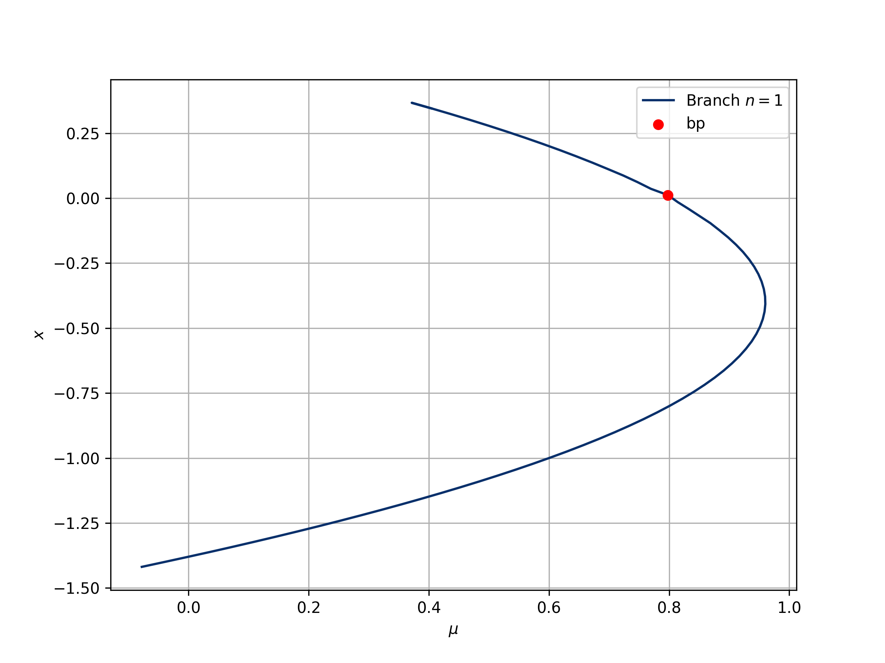

# BifurcationJax
This Jax package aims at performing **automatic bifurcation analysis** of finite-based dimensional equations F(u, λ)=0 where λ is real by taking advantage of iterative methods. Using JAX, a high-performance numerical computing tool, we are able to leverage the computing capacity and perform complex tasks in a matter of milliseconds.
The package is inspired by the well-supported and holistic [BiurcationKit](https://github.com/bifurcationkit/BifurcationKit.jl) package developed in the Julia programming language.

The following list enumerates the current functionalities of this package and the ones that will be incorporated in the following months:

- Nonlinear equations (Newton)
- Bifurcations local (equilibria) and global (periodic orbits)
- Branch Switching
- Bifurcation Diagram
- Continuation Methods
  - Predictor
    - [x] Tangent Predictor
    - [x] Secant Predictor
    - [x] Natural Predictor
    - [ ] BorderedPredictor
  - Corrector
      - [x] Newton Corrector
      - [x] Mixed Corrector
      - [x] PLAC
      - [ ] Moore-Penrose


# Example 1

Let us study the equation 
$$\mathfrak{F}(x, \mu):= \mu + x - \frac{1}{3}x^3$$

```python
def F(x, mu):
    return mu + x - jnp.pow(x, 3)/3

def plot_fn(p):
    return p.z[0]

p0 = 0.
x0 = jnp.array([-2.])

prob = BifurcationProblem(F, x0, p0,)
par = ContinuationPar(p_min=-1., p_max=1., dsmax=0.1, max_steps=500)
correction_params = CorrectorParams(method='PALC', epsilon=1e-3)
prediction_params = PredictorParams(method='tangent', k=0)
diagram = continuation(prob, prediction_params, correction_params, par, max_depth=1)

plot_bifurcation_diagram(diagram, plot_fn=plot_fn)
plt.show()
```


# Example 2
Here is another example, this time we will study the equation
$$\mathfrak{F}(u, p) = \begin{cases}
x' = -x - y\\
y' = -p*z + r*y + s*z^2 - y*z^2\\
z' = -q(x + z)
\end{cases}$$
```python
def maasch_rule(u, p):
    x, y, z = u[...,0], u[...,1], u[...,2]
    q, r, s, = 1.2, 0.8, 0.8
    dx = -x - y
    dy = -p*z + r*y + s*z*z - z*z*y
    dz = -q*(x + z)
    return jnp.stack([dx, dy, dz], axis=-1)


def plot_fn(p):
    return p.z[0]

p0 = 0.0
x0 = jnp.array([-1.4, -1.4, -1.4])

prob = BifurcationProblem(maasch_rule, x0, p0,)
par = ContinuationPar(p_min=-0.1, p_max=2., dsmax=0.05, max_steps=500)
prediction_params = PredictorParams(method='tangent', k=1)
correction_params = CorrectorParams(method='PALC', epsilon=1e-4)
branches = continuation(prob, prediction_params, correction_params, par, max_depth=1, k_start=0)


plot_bifurcation_diagram(branches, plot_fn=plot_fn)
plt.show()
```



# Example 3
This time we will study the equation 
$$\begin{cases}
-u'' = \lambda u - au^3\quad\quad \text{ at }(0,1)\\
u(0) = u(1) = 0\\
\end{cases}$$

```python
N = 40
h = 1/N
t = jnp.linspace(0,1,N)
a=1

def F(x, p):
    x = jax.lax.dynamic_update_slice(jnp.zeros((N,)), x, (1,))
    u_xx = (x[2:] + x[:-2] - 2*x[1:-1])/(h**2)
    return u_xx + p*x[1:-1] - a*jnp.power(x[1:-1],3)
    
def plot_fn(p):
    if p.z[0]>0:
        return jnp.max(p.z[:-1])
    else:
        return jnp.min(p.z[:-1])

p0 = 0.
x0 = jnp.zeros((N-2,)) 

prob = BifurcationProblem(F, x0, p0,)
par = ContinuationPar(p_min=-5., p_max=200., dsmax=0.25, max_steps=1000, branch_switch='normal_orthogonal_direction')
correction_params = CorrectorParams(method='PALC', epsilon=1e-3)
prediction_params = PredictorParams(method='tangent', k=N-2)
branches = continuation(prob, prediction_params, correction_params, par, max_depth=2)


plot_bifurcation_diagram(branches, plot_fn=plot_fn)
plt.show()
```


# Contribute
The package is under development and numourous functionalities will be incorporated in the following months

